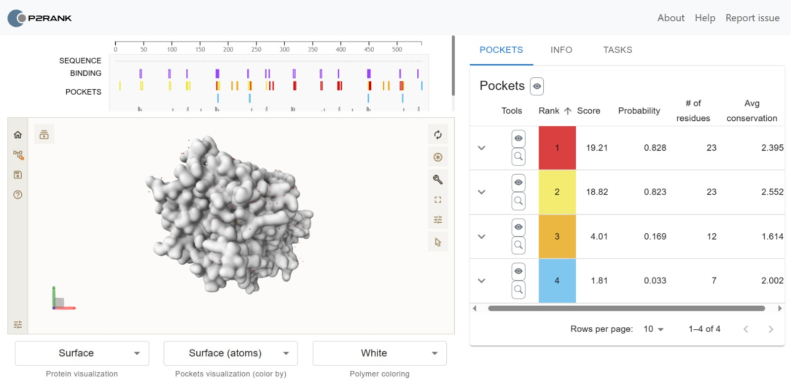
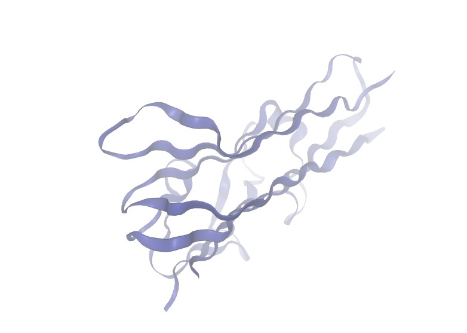
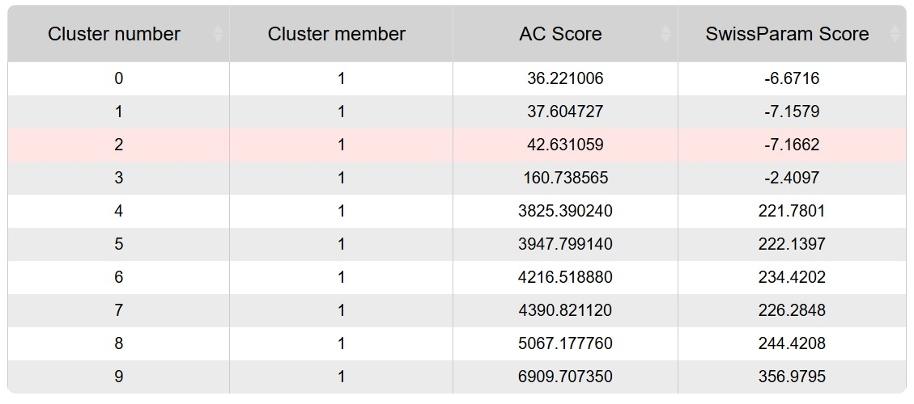

# Tugas-Week-3-BRSP-Dylan
**Laporan Interpretasi Hasil**  
**Molecular Docking TNF dan Beta-Cryptoxanthin**

Molecular docking merupakan salah satu tahap yang penting dalam rangkaian *In Silico Drug Discovery* karena akan digunakan untuk memprediksi kualitas hubungan antara protein dengan ligan yang sesuai. Dalam tugas week 3 ini saya menggunakan protein TNF (*Tumor necrosis factor*) yang diperoleh dari analisa enrichment di week 2 karena TNF memiliki nilai degree yang paling tinggi. TNF (Tumor Necrosis Factor) merupakan sitokin proinflamasi yang berperan dalam mengatur respons imun terhadap infeksi dengan mengaktifkan sel imun dan memediasi proses inflamasi. Pada malaria, peningkatan ekspresi TNF membantu eliminasi Plasmodium, namun produksi yang berlebihan dapat memicu inflamasi berlebihan dan berkontribusi terhadap terjadinya malaria berat, seperti cerebral malaria.

| Kategori | Keterangan |
| :---- | :---- |
| Protein Target | TNF |
| PDB ID | 2AZ5  |
| Resolusi | 2.10 Å |
| Ligan | Beta-Cryptoxanthin (CID: 5281235\) |
| SMILES | CC1=C(C(CCC1)(C)C)/C=C/C(=C/C=C/C(=C/C=C/C=C(\\\\C)/C=C/C=C(\\\\C)/C=C/C2=C(C\[C@H\](CC2(C)C)O)C)/C)/C |

Setelah ditentukan protein yang ingin digunakan, selanjutnya akan dicari kode PDB ID dari protein tersebut dengan situs RCSB PDB dan dicari yang terdapat keterangan protein TNF-a yang berkaitan dengan manusia (diperoleh 2AZ5). Kemudian kode SMILES dari ligan juga harus dicari menggunakan PubChem. Setelah semua siap, saya membuka situs SwissDock untuk melakukan input protein dan ligan. Untuk kolom chain, saya memilih chain B \- Tumour Necrosis Factor, Soluble karena opsi tersebut memberikan tanda centang saat di tekan tombol prepare ligand diikuti dengan opsi none pada kolom heteroatom untuk mencegah tumpang tindih. 

Di tahap selanjutnya, kita perlu mencari search space untuk mencari kemungkinan lokasi *Binding Site*. Namun, karena posisi search box pada awalnya kurang akurat sehingga perlu dicari posisi yang lebih akurat dengan menggunakan PrankWeb seperti berikut:  

Pada awalnya saya menggunakan pockets 1, akan tetapi posisi search box center berada di luar protein sehingga diperlukan pengambilan pocket kedua. Keputusan ini diambil karena keduanya hanya memiliki selisih *score* dan *probability* yang kecil. 

Dari simulasi tersebut diketahui bahwa Cluster 2 memiliki nilai \-7,1662 kcal/mol, yang merupakan nilai paling negatif di antara semua cluster. Dalam molecular docking, semakin negatif nilai energi bebas ikatan (binding free energy), semakin stabil kompleks protein–ligan yang diprediksi terbentuk. Oleh karena itu, Cluster 2 merupakan pose docking yang paling berpotensi menggambarkan interaksi ligan dengan protein TNF. 

Berdasarkan setiap tahapan yang dilalui, terlihat bahwa Pocket 2 memang menunjukkan bahwa TNF dapat masuk ke enzim dengan cukup baik. Secara visual, β-cryptoxanthin tampak menempati binding pocket pada protein TNF (PDB ID: 2AZ5) dengan cukup stabil. Posisi tersebut menunjukkan bahwa β-cryptoxanthin diprediksi mampu berinteraksi dengan residu-residu penting pada TNF, sehingga berpotensi memengaruhi aktivitas protein ini. Mengingat TNF merupakan sitokin proinflamasi yang berperan dalam mengatur respons imun dan berkontribusi terhadap inflamasi berlebihan pada malaria berat, interaksi tersebut mengindikasikan bahwa β-cryptoxanthin berpotensi membantu memodulasi respons inflamasi yang dipicu oleh infeksi *Plasmodium*.
